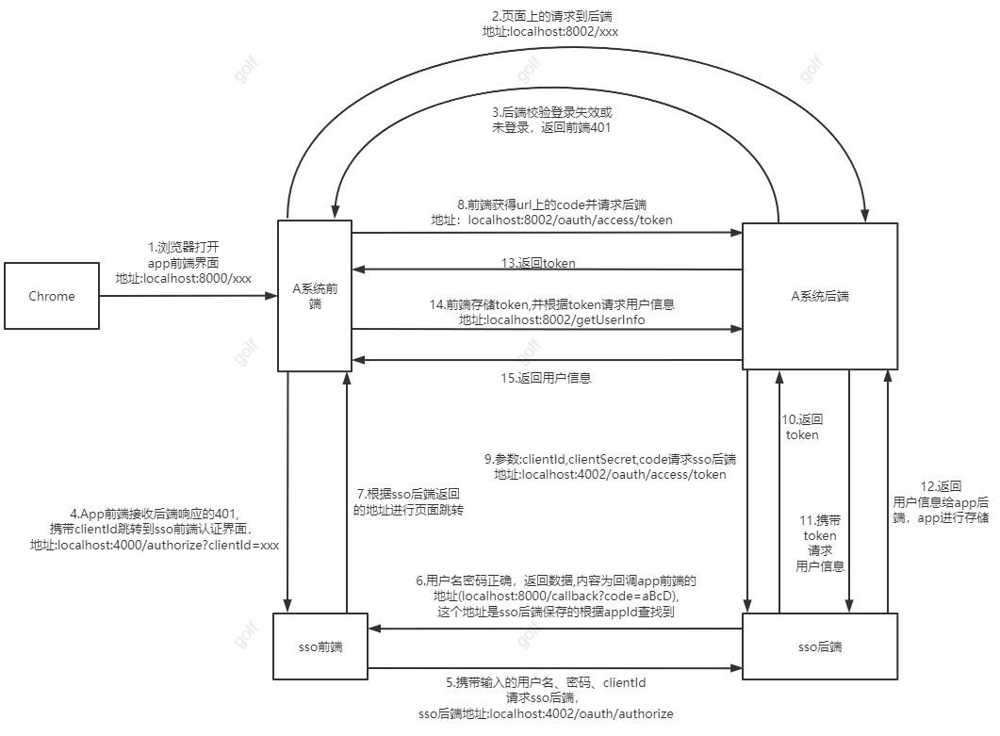

# sso

### 认证流程图

1、2、3步，打开任意前端地址，只要前端请求了任意后端需要登录验证的的请求，后端就会返回401给前端；

4步中携带的clientId、sso前端认证界面地址都是写死在前端的，也可以采用后端返回的方式(这样会更灵活)；

5步中的页面是由4步跳转打开的，5步的页面上会进行输入用户名和密码；

6步中sso后端会根据三个参数进行身份验证，分别是clientId、用户名、密码，如果存在的话，则返回clientId对应的一个url给
sso的前端(?)，url假设为localhost:8000/callback?code=aBcd,localhost:8000/callback是保存在sso数据库中的，和clientId
一一对应的，该url其实是A系统的前端页面地址，?code=是固定写法，主要是为了后续的截取，aBcd是随机生成的授权码，最好保证其唯一性；

7步中sso前端接收到6步中返回的url，在前端进行页面的跳转

8、9步中前端页面在前端获取url上的code对应的内容，携带该内容请求A系统的后端接口(?),A系统后端携带clientId、clientSecret、code请求
sso后端地址生成token(必须保证其唯一性，一般存储到redis中作为key，value为用户信息，此处待考虑用户多出登录的问题，之前的token是否需要删除)。

10、11、12根据token查询用户信息返回给A系统(此处待考虑，为什么不在返回token给A系统的时候就将用户信息一并返回，而是多请求了一次，目前主流的认证登录token和用户信息都是分开返回的)

6、8、9处？,为什么不在第一次返回code的时候就把code当为token，而是用code再次请求sso去生成token? 原因是因为保护一个密码clientSecret，clientSecret不能出现在前端，只能出现在
后端，出现在前端很容易就被获取到。

